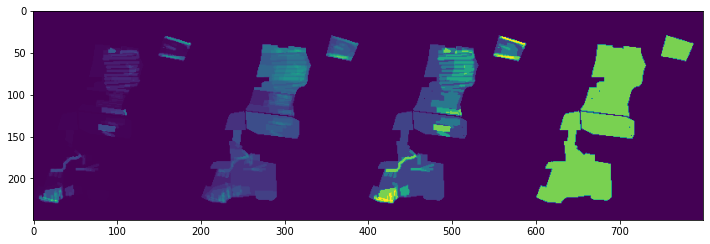
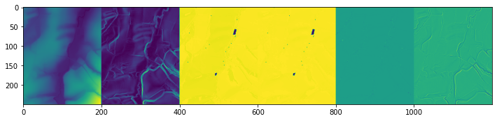
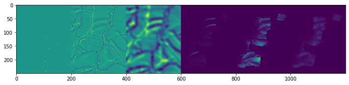
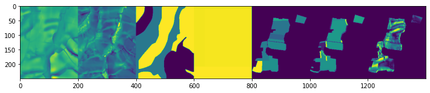
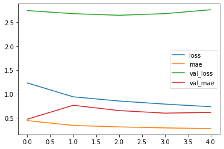
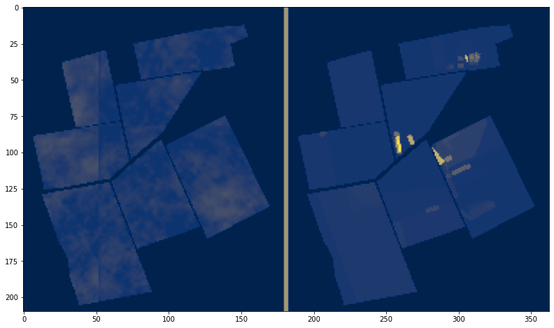

```python
from google.colab import drive
drive.mount('/content/drive')
```

    Mounted at /content/drive
    

# Soil Erosion

In this topic the task is to automatically predict soil loss of agricultural areas. Therefore, a dataset is available in form of several multi-channel maps with a GSD of 5 m. The images contain reference measurements of two target variables that describe the soil loss from 2000 to 2020. Further, the images contain pixel-wise features and masks for the target variables. An overview of the channels is given in the following table:

Cha.-ID|Type|Unit|Explanation / Values
---|---|---|---
0|TV| t / (ha\*a) | Mean annual soil loss
1|TV| Events / a | Frequency of soil loss
2|F| m | Digital elevation Model
3|F| degree | Maximum slope of the surface (in 3x3 window)
4|F| degree | Aspect 360: Direction of maximum slope (in 3x3 window)
5|F| degree |  Aspect, normalised to 180
6|F| - | Plan Curvature
7|F| - | Profile Curvature
8|F| - | Flow Line Curvature 
9|F| - | Divergence-Convergence Index (3x3)
10|F| - | Divergence-Convergence Index (10x10)
11|**E1**| - | Flow accumulation 
12|**E1**| - | Slope length
13|**E1**| - | LS factor 
14|F| - | Topographic Position Index: altitude of pixel in contrast to its neighbours
15|F| - | Wetness Index: modified catchment area calculation
16|F| - | K-factor of USLE
17|F| - | R-factor of USLE
18|**E2**| - | C-factor of USLE
19|**E1**| degree | Machining direction
20|**E1**| degree | Angle between machining direction and aspect
21|TV| - | Classified mean annual soil loss (classes = 0,1,2,3,4)
22|M| - | Target variables available (1) or not (0)

The type is either target variable (TV), Mask (M) or Feature (F, E1, E2). The features are either basic features (F) which are not expensive to obtain, manual features (E1) which are more expensive because they require manual work to obtain them, and complex features (E2) which are very expensive to obtain.


```python
import tifffile
from matplotlib import pyplot as plt
import pandas as pd
import numpy as np
import seaborn as sns
from sklearn.ensemble import RandomForestRegressor as RFR, RandomForestClassifier as RFC
```

The code in the next cell shows the channels of one areas.


```python
plt.rcParams['figure.figsize'] = [12, 5]
# data_root = "./data/"
data_root = "/content/drive/MyDrive/hackrock2/"

r = "1" # region 2 is the test-area
I = tifffile.imread(f"{data_root}region{r}.tiff")

print("Target Variables (0, 1, 21) and Mask (22)")
target_variables = [I[0].clip(0)/np.max(I[0]),I[1].clip(0)/np.max(I[1]),
                    (I[21]+1).clip(0)/np.max(I[21]), I[22]]
plt.imshow(np.hstack(target_variables))
plt.show()

print("Channels 2-7")
normalized_channels = [(c-np.min(c))/(np.max(c)-np.min(c)) for c in I[2:8]]
plt.imshow(np.hstack(normalized_channels))
plt.show()

print("Channels 8-13")
normalized_channels = [(c-np.min(c))/(np.max(c)-np.min(c)) for c in I[8:11]]
normalized_channels += [((c)/(np.max(c))).clip(0) for c in I[11:14]]
plt.imshow(np.hstack(normalized_channels))
plt.show()

print("Channels 14-20")
normalized_channels = [(c-np.min(c))/(np.max(c)-np.min(c)) for c in I[14:17]]
normalized_channels += [((c)/(np.max(c))).clip(0) for c in I[17:21]]
plt.imshow(np.hstack(normalized_channels))
plt.show()
```

    Target Variables (0, 1, 21) and Mask (22)
    





    Channels 2-7
    





    Channels 8-13
    





    Channels 14-20
    





```python
#data_root = "./data/"
data_root = "/content/drive/MyDrive/hackrock2/"

train_rs = ["1", "3a", "3b", "3c", "3d"] 
test_rs = ["2"]
valid_rs = ['4']


train_Is = [tifffile.imread(f"{data_root}region{r}.tiff") for r in train_rs]

valid_Is = [tifffile.imread(f"{data_root}region{r}.tiff") for r in valid_rs]

test_Is = [tifffile.imread(f"{data_root}region{r}.tiff") for r in test_rs]

```


```python
from sklearn.feature_extraction.image import extract_patches_2d
```


```python
# Features to use (here only a few channels)
F_Channels = [3, 20, 11, 12, 13, 16, 17]

# Target variable: 0, 1 (Regression) or 21 (Classification)
TV = 0

def prepare_data(data_Is, num_patches=500):
    data = []
    output_channel = TV # RAMISH please change to 1
    for ti in data_Is:
        # normalize DEMs
        for input_channel in F_Channels:
            ti[input_channel] = (ti[input_channel]-np.min(ti[input_channel]))/(np.max(ti[input_channel])-np.min(ti[input_channel]))  
        ti[output_channel] = ti[output_channel].clip(0)#/np.max(ti[output_channel])
        data.append(ti[F_Channels + [TV]])
    data = [
        extract_patches_2d(
            data[i].transpose(1,2,0),
            (128, 128),
            max_patches=num_patches
        )
        for i in range(len(data_Is))
    ]
    data = np.concatenate(data, 0)
    print(data.shape)
    # return DEMs as inputs, mean annual soil loss as target
    return data[:,:,:,:-1], np.expand_dims(data[:,:,:,-1], -1)
    
```


```python
train_x, train_y = prepare_data(train_Is)
valid_x, valid_y = prepare_data(valid_Is)
```

    (2500, 128, 128, 14)
    (500, 128, 128, 14)
    


```python
print(train_x.shape, train_y.shape, valid_x.shape, valid_y.shape)
```

    (2500, 128, 128, 13) (2500, 128, 128, 1) (500, 128, 128, 13) (500, 128, 128, 1)
    


```python
print(train_x.max(), train_y.max(), valid_x.max(), valid_y.max())
```

    1.0 51.826224962736006 1.0 57.51658557227111
    


```python
print(train_x.min(), train_y.min(), valid_x.min(), valid_y.min())
```

    0.0 0.0 0.0 0.0
    


```python
from keras.models import Model
from keras.layers import Input, Conv2D, BatchNormalization, Activation, Dense
from keras.layers import UpSampling2D, add, concatenate, Add, GlobalAveragePooling2D, MaxPooling2D, Concatenate
import keras
import numpy as np
import random 
import tensorflow as tf 
```


```python
def conv3x3(x, out_filters, strides=(1, 1)):
    x = Conv2D(out_filters, 3, padding='same', strides=strides, use_bias=False, kernel_initializer='he_normal')(x)
    return x


def basic_Block(input, out_filters, strides=(1, 1), with_conv_shortcut=False):
    x = conv3x3(input, out_filters, strides)
    x = BatchNormalization(axis=3)(x)
    x = Activation('relu')(x)

    x = conv3x3(x, out_filters)
    x = BatchNormalization(axis=3)(x)

    if with_conv_shortcut:
        residual = Conv2D(out_filters, 1, strides=strides, use_bias=False, kernel_initializer='he_normal')(input)
        residual = BatchNormalization(axis=3)(residual)
        x = add([x, residual])
    else:
        x = add([x, input])

    x = Activation('relu')(x)
    return x


def bottleneck_Block(input, out_filters, strides=(1, 1), with_conv_shortcut=False):
    expansion = 4
    de_filters = int(out_filters / expansion)

    x = Conv2D(de_filters, 1, use_bias=False, kernel_initializer='he_normal')(input)
    x = BatchNormalization(axis=3)(x)
    x = Activation('relu')(x)

    x = Conv2D(de_filters, 3, strides=strides, padding='same', use_bias=False, kernel_initializer='he_normal')(x)
    x = BatchNormalization(axis=3)(x)
    x = Activation('relu')(x)

    x = Conv2D(out_filters, 1, use_bias=False, kernel_initializer='he_normal')(x)
    x = BatchNormalization(axis=3)(x)

    if with_conv_shortcut:
        residual = Conv2D(out_filters, 1, strides=strides, use_bias=False, kernel_initializer='he_normal')(input)
        residual = BatchNormalization(axis=3)(residual)
        x = add([x, residual])
    else:
        x = add([x, input])

    x = Activation('relu')(x)
    return x


def stem_net(input):
    x = Conv2D(64, 3, strides=(2, 2), padding='same', use_bias=False, kernel_initializer='he_normal')(input)
    x = BatchNormalization(axis=3)(x)
    x = Activation('relu')(x)

    x = bottleneck_Block(x, 256, with_conv_shortcut=True)
    x = bottleneck_Block(x, 256, with_conv_shortcut=False)

    return x

def transition_layer1(x, out_filters_list=[32, 64]):
    x0 = Conv2D(out_filters_list[0], 3, padding='same', use_bias=False, kernel_initializer='he_normal')(x)
    x0 = BatchNormalization(axis=3)(x0)
    x0 = Activation('relu')(x0)

    x1 = Conv2D(out_filters_list[1], 3, strides=(2, 2),
                padding='same', use_bias=False, kernel_initializer='he_normal')(x)
    x1 = BatchNormalization(axis=3)(x1)
    x1 = Activation('relu')(x1)

    return [x0, x1]


def make_branch1_0(x, out_filters=32):
    x = basic_Block(x, out_filters, with_conv_shortcut=False)
    x = basic_Block(x, out_filters, with_conv_shortcut=False)
    return x


def make_branch1_1(x, out_filters=64):
    x = basic_Block(x, out_filters, with_conv_shortcut=False)
    x = basic_Block(x, out_filters, with_conv_shortcut=False)
    return x


def fuse_layer1(x):
    x0_0 = x[0]
    x0_1 = Conv2D(32, 1, use_bias=False, kernel_initializer='he_normal')(x[1])
    x0_1 = BatchNormalization(axis=3)(x0_1)
    x0_1 = UpSampling2D(size=(2, 2),interpolation='bilinear')(x0_1)
    x0 = add([x0_0, x0_1])

    x1_0 = Conv2D(64, 3, strides=(2, 2), padding='same', use_bias=False, kernel_initializer='he_normal')(x[0])
    x1_0 = BatchNormalization(axis=3)(x1_0)
    x1_1 = x[1]
    x1 = add([x1_0, x1_1])
    return [x0, x1]


def transition_layer2(x, out_filters_list=[32, 64, 128]):
    x0 = Conv2D(out_filters_list[0], 3, padding='same', use_bias=False, kernel_initializer='he_normal')(x[0])
    x0 = BatchNormalization(axis=3)(x0)
    x0 = Activation('relu')(x0)

    x1 = Conv2D(out_filters_list[1], 3, padding='same', use_bias=False, kernel_initializer='he_normal')(x[1])
    x1 = BatchNormalization(axis=3)(x1)
    x1 = Activation('relu')(x1)

    x2 = Conv2D(out_filters_list[2], 3, strides=(2, 2),
                padding='same', use_bias=False, kernel_initializer='he_normal')(x[1])
    x2 = BatchNormalization(axis=3)(x2)
    x2 = Activation('relu')(x2)

    return [x0, x1, x2]


def make_branch2_0(x, out_filters=32):
    x = basic_Block(x, out_filters, with_conv_shortcut=False)
    x = basic_Block(x, out_filters, with_conv_shortcut=False)
    return x


def make_branch2_1(x, out_filters=64):
    x = basic_Block(x, out_filters, with_conv_shortcut=False)
    x = basic_Block(x, out_filters, with_conv_shortcut=False)
    return x


def make_branch2_2(x, out_filters=128):
    x = basic_Block(x, out_filters, with_conv_shortcut=False)
    x = basic_Block(x, out_filters, with_conv_shortcut=False)
    return x


def fuse_layer2(x):
    x0_0 = x[0]
    x0_1 = Conv2D(32, 1, use_bias=False, kernel_initializer='he_normal')(x[1])
    x0_1 = BatchNormalization(axis=3)(x0_1)
    x0_1 = UpSampling2D(size=(2, 2),interpolation='bilinear')(x0_1)
    x0_2 = Conv2D(32, 1, use_bias=False, kernel_initializer='he_normal')(x[2])
    x0_2 = BatchNormalization(axis=3)(x0_2)
    x0_2 = UpSampling2D(size=(4, 4),interpolation='bilinear')(x0_2)
    x0 = add([x0_0, x0_1, x0_2])

    x1_0 = Conv2D(64, 3, strides=(2, 2), padding='same', use_bias=False, kernel_initializer='he_normal')(x[0])
    x1_0 = BatchNormalization(axis=3)(x1_0)
    x1_1 = x[1]
    x1_2 = Conv2D(64, 1, use_bias=False, kernel_initializer='he_normal')(x[2])
    x1_2 = BatchNormalization(axis=3)(x1_2)
    x1_2 = UpSampling2D(size=(2, 2),interpolation='bilinear')(x1_2)
    x1 = add([x1_0, x1_1, x1_2])

    x2_0 = Conv2D(32, 3, strides=(2, 2), padding='same', use_bias=False, kernel_initializer='he_normal')(x[0])
    x2_0 = BatchNormalization(axis=3)(x2_0)
    x2_0 = Activation('relu')(x2_0)
    x2_0 = Conv2D(128, 3, strides=(2, 2), padding='same', use_bias=False, kernel_initializer='he_normal')(x2_0)
    x2_0 = BatchNormalization(axis=3)(x2_0)
    x2_1 = Conv2D(128, 3, strides=(2, 2), padding='same', use_bias=False, kernel_initializer='he_normal')(x[1])
    x2_1 = BatchNormalization(axis=3)(x2_1)
    x2_2 = x[2]
    x2 = add([x2_0, x2_1, x2_2])
    return [x0, x1, x2]


def transition_layer3(x, out_filters_list=[32, 64, 128, 256]):
    x0 = Conv2D(out_filters_list[0], 3, padding='same', use_bias=False, kernel_initializer='he_normal')(x[0])
    x0 = BatchNormalization(axis=3)(x0)
    x0 = Activation('relu')(x0)

    x1 = Conv2D(out_filters_list[1], 3, padding='same', use_bias=False, kernel_initializer='he_normal')(x[1])
    x1 = BatchNormalization(axis=3)(x1)
    x1 = Activation('relu')(x1)

    x2 = Conv2D(out_filters_list[2], 3, padding='same', use_bias=False, kernel_initializer='he_normal')(x[2])
    x2 = BatchNormalization(axis=3)(x2)
    x2 = Activation('relu')(x2)

    x3 = Conv2D(out_filters_list[3], 3, strides=(2, 2),
                padding='same', use_bias=False, kernel_initializer='he_normal')(x[2])
    x3 = BatchNormalization(axis=3)(x3)
    x3 = Activation('relu')(x3)

    return [x0, x1, x2, x3]


def make_branch3_0(x, out_filters=32):
    x = basic_Block(x, out_filters, with_conv_shortcut=False)
    x = basic_Block(x, out_filters, with_conv_shortcut=False)
    return x


def make_branch3_1(x, out_filters=64):
    x = basic_Block(x, out_filters, with_conv_shortcut=False)
    x = basic_Block(x, out_filters, with_conv_shortcut=False)
    return x


def make_branch3_2(x, out_filters=128):
    x = basic_Block(x, out_filters, with_conv_shortcut=False)
    x = basic_Block(x, out_filters, with_conv_shortcut=False)
    return x


def make_branch3_3(x, out_filters=256):
    x = basic_Block(x, out_filters, with_conv_shortcut=False)
    x = basic_Block(x, out_filters, with_conv_shortcut=False)
    return x


def fuse_layer3(x):
    x0_0 = x[0]
    x0_1 = Conv2D(32, 1, use_bias=False, kernel_initializer='he_normal')(x[1])
    x0_1 = BatchNormalization(axis=3)(x0_1)
    x0_1 = UpSampling2D(size=(2, 2),interpolation='bilinear')(x0_1)
    x0_2 = Conv2D(32, 1, use_bias=False, kernel_initializer='he_normal')(x[2])
    x0_2 = BatchNormalization(axis=3)(x0_2)
    x0_2 = UpSampling2D(size=(4, 4),interpolation='bilinear')(x0_2)
    x0_3 = Conv2D(32, 1, use_bias=False, kernel_initializer='he_normal')(x[3])
    x0_3 = BatchNormalization(axis=3)(x0_3)
    x0_3 = UpSampling2D(size=(8, 8),interpolation='bilinear')(x0_3)
    x0 = concatenate([x0_0, x0_1, x0_2, x0_3], axis=-1)
    return x0

def feature_extractor1(inputs):

    x = stem_net(inputs)

    x = transition_layer1(x)
    x0 = make_branch1_0(x[0])
    x1 = make_branch1_1(x[1])
    x = fuse_layer1([x0, x1])

    x = transition_layer2(x)
    x0 = make_branch2_0(x[0])
    x1 = make_branch2_1(x[1])
    x2 = make_branch2_2(x[2])
    x = fuse_layer2([x0, x1, x2])

    x = transition_layer3(x)
    x0 = make_branch3_0(x[0])
    x1 = make_branch3_1(x[1])
    x2 = make_branch3_2(x[2])
    x3 = make_branch3_3(x[3])
    x = fuse_layer3([x0, x1, x2, x3])

    phase3 = Model(inputs=inputs, outputs=x, name='phase3')

    return x, phase3

def hrnet_segmenter(input_shape=(128, 128, 1), output_channels=1):
    inputs = Input(shape=input_shape)
    x, phase3 = feature_extractor1(inputs)
    
    x = basic_Block(x, 128, with_conv_shortcut=False)

    x = UpSampling2D(size=(2, 2),interpolation='bilinear')(x)
    x = Conv2D(output_channels, 1, use_bias=False, kernel_initializer='he_normal')(x)
    x = BatchNormalization(axis=3)(x)

    final_activation = 'relu' if output_channels == 1 else 'softmax'
    out = Activation(final_activation, name='out')(x)

    model = Model(inputs=inputs, outputs=out)
    model.summary()

    return model
```


```python
model = hrnet_segmenter((128,128,len(F_Channels)))
```

    Model: "model"
    __________________________________________________________________________________________________
    Layer (type)                    Output Shape         Param #     Connected to                     
    ==================================================================================================
    input_1 (InputLayer)            [(None, 128, 128, 13 0                                            
    __________________________________________________________________________________________________
    conv2d (Conv2D)                 (None, 64, 64, 64)   7488        input_1[0][0]                    
    __________________________________________________________________________________________________
    batch_normalization (BatchNorma (None, 64, 64, 64)   256         conv2d[0][0]                     
    __________________________________________________________________________________________________
    activation (Activation)         (None, 64, 64, 64)   0           batch_normalization[0][0]        
    __________________________________________________________________________________________________
    conv2d_1 (Conv2D)               (None, 64, 64, 64)   4096        activation[0][0]                 
    __________________________________________________________________________________________________
    batch_normalization_1 (BatchNor (None, 64, 64, 64)   256         conv2d_1[0][0]                   
    __________________________________________________________________________________________________
    activation_1 (Activation)       (None, 64, 64, 64)   0           batch_normalization_1[0][0]      
    __________________________________________________________________________________________________
    conv2d_2 (Conv2D)               (None, 64, 64, 64)   36864       activation_1[0][0]               
    __________________________________________________________________________________________________
    batch_normalization_2 (BatchNor (None, 64, 64, 64)   256         conv2d_2[0][0]                   
    __________________________________________________________________________________________________
    activation_2 (Activation)       (None, 64, 64, 64)   0           batch_normalization_2[0][0]      
    __________________________________________________________________________________________________
    conv2d_3 (Conv2D)               (None, 64, 64, 256)  16384       activation_2[0][0]               
    __________________________________________________________________________________________________
    conv2d_4 (Conv2D)               (None, 64, 64, 256)  16384       activation[0][0]                 
    __________________________________________________________________________________________________
    batch_normalization_3 (BatchNor (None, 64, 64, 256)  1024        conv2d_3[0][0]                   
    __________________________________________________________________________________________________
    batch_normalization_4 (BatchNor (None, 64, 64, 256)  1024        conv2d_4[0][0]                   
    __________________________________________________________________________________________________
    add (Add)                       (None, 64, 64, 256)  0           batch_normalization_3[0][0]      
                                                                     batch_normalization_4[0][0]      
    __________________________________________________________________________________________________
    activation_3 (Activation)       (None, 64, 64, 256)  0           add[0][0]                        
    __________________________________________________________________________________________________
    conv2d_5 (Conv2D)               (None, 64, 64, 64)   16384       activation_3[0][0]               
    __________________________________________________________________________________________________
    batch_normalization_5 (BatchNor (None, 64, 64, 64)   256         conv2d_5[0][0]                   
    __________________________________________________________________________________________________
    activation_4 (Activation)       (None, 64, 64, 64)   0           batch_normalization_5[0][0]      
    __________________________________________________________________________________________________
    conv2d_6 (Conv2D)               (None, 64, 64, 64)   36864       activation_4[0][0]               
    __________________________________________________________________________________________________
    batch_normalization_6 (BatchNor (None, 64, 64, 64)   256         conv2d_6[0][0]                   
    __________________________________________________________________________________________________
    activation_5 (Activation)       (None, 64, 64, 64)   0           batch_normalization_6[0][0]      
    __________________________________________________________________________________________________
    conv2d_7 (Conv2D)               (None, 64, 64, 256)  16384       activation_5[0][0]               
    __________________________________________________________________________________________________
    batch_normalization_7 (BatchNor (None, 64, 64, 256)  1024        conv2d_7[0][0]                   
    __________________________________________________________________________________________________
    add_1 (Add)                     (None, 64, 64, 256)  0           batch_normalization_7[0][0]      
                                                                     activation_3[0][0]               
    __________________________________________________________________________________________________
    activation_6 (Activation)       (None, 64, 64, 256)  0           add_1[0][0]                      
    __________________________________________________________________________________________________
    conv2d_9 (Conv2D)               (None, 32, 32, 64)   147456      activation_6[0][0]               
    __________________________________________________________________________________________________
    batch_normalization_9 (BatchNor (None, 32, 32, 64)   256         conv2d_9[0][0]                   
    __________________________________________________________________________________________________
    activation_8 (Activation)       (None, 32, 32, 64)   0           batch_normalization_9[0][0]      
    __________________________________________________________________________________________________
    conv2d_8 (Conv2D)               (None, 64, 64, 32)   73728       activation_6[0][0]               
    __________________________________________________________________________________________________
    conv2d_14 (Conv2D)              (None, 32, 32, 64)   36864       activation_8[0][0]               
    __________________________________________________________________________________________________
    batch_normalization_8 (BatchNor (None, 64, 64, 32)   128         conv2d_8[0][0]                   
    __________________________________________________________________________________________________
    batch_normalization_14 (BatchNo (None, 32, 32, 64)   256         conv2d_14[0][0]                  
    __________________________________________________________________________________________________
    activation_7 (Activation)       (None, 64, 64, 32)   0           batch_normalization_8[0][0]      
    __________________________________________________________________________________________________
    activation_13 (Activation)      (None, 32, 32, 64)   0           batch_normalization_14[0][0]     
    __________________________________________________________________________________________________
    conv2d_10 (Conv2D)              (None, 64, 64, 32)   9216        activation_7[0][0]               
    __________________________________________________________________________________________________
    conv2d_15 (Conv2D)              (None, 32, 32, 64)   36864       activation_13[0][0]              
    __________________________________________________________________________________________________
    batch_normalization_10 (BatchNo (None, 64, 64, 32)   128         conv2d_10[0][0]                  
    __________________________________________________________________________________________________
    batch_normalization_15 (BatchNo (None, 32, 32, 64)   256         conv2d_15[0][0]                  
    __________________________________________________________________________________________________
    activation_9 (Activation)       (None, 64, 64, 32)   0           batch_normalization_10[0][0]     
    __________________________________________________________________________________________________
    add_4 (Add)                     (None, 32, 32, 64)   0           batch_normalization_15[0][0]     
                                                                     activation_8[0][0]               
    __________________________________________________________________________________________________
    conv2d_11 (Conv2D)              (None, 64, 64, 32)   9216        activation_9[0][0]               
    __________________________________________________________________________________________________
    activation_14 (Activation)      (None, 32, 32, 64)   0           add_4[0][0]                      
    __________________________________________________________________________________________________
    batch_normalization_11 (BatchNo (None, 64, 64, 32)   128         conv2d_11[0][0]                  
    __________________________________________________________________________________________________
    conv2d_16 (Conv2D)              (None, 32, 32, 64)   36864       activation_14[0][0]              
    __________________________________________________________________________________________________
    add_2 (Add)                     (None, 64, 64, 32)   0           batch_normalization_11[0][0]     
                                                                     activation_7[0][0]               
    __________________________________________________________________________________________________
    batch_normalization_16 (BatchNo (None, 32, 32, 64)   256         conv2d_16[0][0]                  
    __________________________________________________________________________________________________
    activation_10 (Activation)      (None, 64, 64, 32)   0           add_2[0][0]                      
    __________________________________________________________________________________________________
    activation_15 (Activation)      (None, 32, 32, 64)   0           batch_normalization_16[0][0]     
    __________________________________________________________________________________________________
    conv2d_12 (Conv2D)              (None, 64, 64, 32)   9216        activation_10[0][0]              
    __________________________________________________________________________________________________
    conv2d_17 (Conv2D)              (None, 32, 32, 64)   36864       activation_15[0][0]              
    __________________________________________________________________________________________________
    batch_normalization_12 (BatchNo (None, 64, 64, 32)   128         conv2d_12[0][0]                  
    __________________________________________________________________________________________________
    batch_normalization_17 (BatchNo (None, 32, 32, 64)   256         conv2d_17[0][0]                  
    __________________________________________________________________________________________________
    activation_11 (Activation)      (None, 64, 64, 32)   0           batch_normalization_12[0][0]     
    __________________________________________________________________________________________________
    add_5 (Add)                     (None, 32, 32, 64)   0           batch_normalization_17[0][0]     
                                                                     activation_14[0][0]              
    __________________________________________________________________________________________________
    conv2d_13 (Conv2D)              (None, 64, 64, 32)   9216        activation_11[0][0]              
    __________________________________________________________________________________________________
    activation_16 (Activation)      (None, 32, 32, 64)   0           add_5[0][0]                      
    __________________________________________________________________________________________________
    batch_normalization_13 (BatchNo (None, 64, 64, 32)   128         conv2d_13[0][0]                  
    __________________________________________________________________________________________________
    conv2d_18 (Conv2D)              (None, 32, 32, 32)   2048        activation_16[0][0]              
    __________________________________________________________________________________________________
    add_3 (Add)                     (None, 64, 64, 32)   0           batch_normalization_13[0][0]     
                                                                     activation_10[0][0]              
    __________________________________________________________________________________________________
    batch_normalization_18 (BatchNo (None, 32, 32, 32)   128         conv2d_18[0][0]                  
    __________________________________________________________________________________________________
    activation_12 (Activation)      (None, 64, 64, 32)   0           add_3[0][0]                      
    __________________________________________________________________________________________________
    up_sampling2d (UpSampling2D)    (None, 64, 64, 32)   0           batch_normalization_18[0][0]     
    __________________________________________________________________________________________________
    add_6 (Add)                     (None, 64, 64, 32)   0           activation_12[0][0]              
                                                                     up_sampling2d[0][0]              
    __________________________________________________________________________________________________
    conv2d_19 (Conv2D)              (None, 32, 32, 64)   18432       activation_12[0][0]              
    __________________________________________________________________________________________________
    conv2d_20 (Conv2D)              (None, 64, 64, 32)   9216        add_6[0][0]                      
    __________________________________________________________________________________________________
    batch_normalization_19 (BatchNo (None, 32, 32, 64)   256         conv2d_19[0][0]                  
    __________________________________________________________________________________________________
    batch_normalization_20 (BatchNo (None, 64, 64, 32)   128         conv2d_20[0][0]                  
    __________________________________________________________________________________________________
    add_7 (Add)                     (None, 32, 32, 64)   0           batch_normalization_19[0][0]     
                                                                     activation_16[0][0]              
    __________________________________________________________________________________________________
    activation_17 (Activation)      (None, 64, 64, 32)   0           batch_normalization_20[0][0]     
    __________________________________________________________________________________________________
    conv2d_22 (Conv2D)              (None, 16, 16, 128)  73728       add_7[0][0]                      
    __________________________________________________________________________________________________
    conv2d_23 (Conv2D)              (None, 64, 64, 32)   9216        activation_17[0][0]              
    __________________________________________________________________________________________________
    conv2d_21 (Conv2D)              (None, 32, 32, 64)   36864       add_7[0][0]                      
    __________________________________________________________________________________________________
    batch_normalization_22 (BatchNo (None, 16, 16, 128)  512         conv2d_22[0][0]                  
    __________________________________________________________________________________________________
    batch_normalization_23 (BatchNo (None, 64, 64, 32)   128         conv2d_23[0][0]                  
    __________________________________________________________________________________________________
    batch_normalization_21 (BatchNo (None, 32, 32, 64)   256         conv2d_21[0][0]                  
    __________________________________________________________________________________________________
    activation_19 (Activation)      (None, 16, 16, 128)  0           batch_normalization_22[0][0]     
    __________________________________________________________________________________________________
    activation_20 (Activation)      (None, 64, 64, 32)   0           batch_normalization_23[0][0]     
    __________________________________________________________________________________________________
    activation_18 (Activation)      (None, 32, 32, 64)   0           batch_normalization_21[0][0]     
    __________________________________________________________________________________________________
    conv2d_31 (Conv2D)              (None, 16, 16, 128)  147456      activation_19[0][0]              
    __________________________________________________________________________________________________
    conv2d_24 (Conv2D)              (None, 64, 64, 32)   9216        activation_20[0][0]              
    __________________________________________________________________________________________________
    conv2d_27 (Conv2D)              (None, 32, 32, 64)   36864       activation_18[0][0]              
    __________________________________________________________________________________________________
    batch_normalization_31 (BatchNo (None, 16, 16, 128)  512         conv2d_31[0][0]                  
    __________________________________________________________________________________________________
    batch_normalization_24 (BatchNo (None, 64, 64, 32)   128         conv2d_24[0][0]                  
    __________________________________________________________________________________________________
    batch_normalization_27 (BatchNo (None, 32, 32, 64)   256         conv2d_27[0][0]                  
    __________________________________________________________________________________________________
    activation_28 (Activation)      (None, 16, 16, 128)  0           batch_normalization_31[0][0]     
    __________________________________________________________________________________________________
    add_8 (Add)                     (None, 64, 64, 32)   0           batch_normalization_24[0][0]     
                                                                     activation_17[0][0]              
    __________________________________________________________________________________________________
    activation_24 (Activation)      (None, 32, 32, 64)   0           batch_normalization_27[0][0]     
    __________________________________________________________________________________________________
    conv2d_32 (Conv2D)              (None, 16, 16, 128)  147456      activation_28[0][0]              
    __________________________________________________________________________________________________
    activation_21 (Activation)      (None, 64, 64, 32)   0           add_8[0][0]                      
    __________________________________________________________________________________________________
    conv2d_28 (Conv2D)              (None, 32, 32, 64)   36864       activation_24[0][0]              
    __________________________________________________________________________________________________
    batch_normalization_32 (BatchNo (None, 16, 16, 128)  512         conv2d_32[0][0]                  
    __________________________________________________________________________________________________
    conv2d_25 (Conv2D)              (None, 64, 64, 32)   9216        activation_21[0][0]              
    __________________________________________________________________________________________________
    batch_normalization_28 (BatchNo (None, 32, 32, 64)   256         conv2d_28[0][0]                  
    __________________________________________________________________________________________________
    add_12 (Add)                    (None, 16, 16, 128)  0           batch_normalization_32[0][0]     
                                                                     activation_19[0][0]              
    __________________________________________________________________________________________________
    batch_normalization_25 (BatchNo (None, 64, 64, 32)   128         conv2d_25[0][0]                  
    __________________________________________________________________________________________________
    add_10 (Add)                    (None, 32, 32, 64)   0           batch_normalization_28[0][0]     
                                                                     activation_18[0][0]              
    __________________________________________________________________________________________________
    activation_29 (Activation)      (None, 16, 16, 128)  0           add_12[0][0]                     
    __________________________________________________________________________________________________
    activation_22 (Activation)      (None, 64, 64, 32)   0           batch_normalization_25[0][0]     
    __________________________________________________________________________________________________
    activation_25 (Activation)      (None, 32, 32, 64)   0           add_10[0][0]                     
    __________________________________________________________________________________________________
    conv2d_33 (Conv2D)              (None, 16, 16, 128)  147456      activation_29[0][0]              
    __________________________________________________________________________________________________
    conv2d_26 (Conv2D)              (None, 64, 64, 32)   9216        activation_22[0][0]              
    __________________________________________________________________________________________________
    conv2d_29 (Conv2D)              (None, 32, 32, 64)   36864       activation_25[0][0]              
    __________________________________________________________________________________________________
    batch_normalization_33 (BatchNo (None, 16, 16, 128)  512         conv2d_33[0][0]                  
    __________________________________________________________________________________________________
    batch_normalization_26 (BatchNo (None, 64, 64, 32)   128         conv2d_26[0][0]                  
    __________________________________________________________________________________________________
    batch_normalization_29 (BatchNo (None, 32, 32, 64)   256         conv2d_29[0][0]                  
    __________________________________________________________________________________________________
    activation_30 (Activation)      (None, 16, 16, 128)  0           batch_normalization_33[0][0]     
    __________________________________________________________________________________________________
    add_9 (Add)                     (None, 64, 64, 32)   0           batch_normalization_26[0][0]     
                                                                     activation_21[0][0]              
    __________________________________________________________________________________________________
    activation_26 (Activation)      (None, 32, 32, 64)   0           batch_normalization_29[0][0]     
    __________________________________________________________________________________________________
    conv2d_34 (Conv2D)              (None, 16, 16, 128)  147456      activation_30[0][0]              
    __________________________________________________________________________________________________
    activation_23 (Activation)      (None, 64, 64, 32)   0           add_9[0][0]                      
    __________________________________________________________________________________________________
    conv2d_30 (Conv2D)              (None, 32, 32, 64)   36864       activation_26[0][0]              
    __________________________________________________________________________________________________
    batch_normalization_34 (BatchNo (None, 16, 16, 128)  512         conv2d_34[0][0]                  
    __________________________________________________________________________________________________
    batch_normalization_30 (BatchNo (None, 32, 32, 64)   256         conv2d_30[0][0]                  
    __________________________________________________________________________________________________
    add_13 (Add)                    (None, 16, 16, 128)  0           batch_normalization_34[0][0]     
                                                                     activation_29[0][0]              
    __________________________________________________________________________________________________
    conv2d_39 (Conv2D)              (None, 32, 32, 32)   9216        activation_23[0][0]              
    __________________________________________________________________________________________________
    add_11 (Add)                    (None, 32, 32, 64)   0           batch_normalization_30[0][0]     
                                                                     activation_25[0][0]              
    __________________________________________________________________________________________________
    activation_31 (Activation)      (None, 16, 16, 128)  0           add_13[0][0]                     
    __________________________________________________________________________________________________
    batch_normalization_39 (BatchNo (None, 32, 32, 32)   128         conv2d_39[0][0]                  
    __________________________________________________________________________________________________
    activation_27 (Activation)      (None, 32, 32, 64)   0           add_11[0][0]                     
    __________________________________________________________________________________________________
    conv2d_38 (Conv2D)              (None, 16, 16, 64)   8192        activation_31[0][0]              
    __________________________________________________________________________________________________
    activation_32 (Activation)      (None, 32, 32, 32)   0           batch_normalization_39[0][0]     
    __________________________________________________________________________________________________
    conv2d_37 (Conv2D)              (None, 32, 32, 64)   18432       activation_23[0][0]              
    __________________________________________________________________________________________________
    batch_normalization_38 (BatchNo (None, 16, 16, 64)   256         conv2d_38[0][0]                  
    __________________________________________________________________________________________________
    conv2d_40 (Conv2D)              (None, 16, 16, 128)  36864       activation_32[0][0]              
    __________________________________________________________________________________________________
    conv2d_41 (Conv2D)              (None, 16, 16, 128)  73728       activation_27[0][0]              
    __________________________________________________________________________________________________
    batch_normalization_37 (BatchNo (None, 32, 32, 64)   256         conv2d_37[0][0]                  
    __________________________________________________________________________________________________
    up_sampling2d_3 (UpSampling2D)  (None, 32, 32, 64)   0           batch_normalization_38[0][0]     
    __________________________________________________________________________________________________
    batch_normalization_40 (BatchNo (None, 16, 16, 128)  512         conv2d_40[0][0]                  
    __________________________________________________________________________________________________
    batch_normalization_41 (BatchNo (None, 16, 16, 128)  512         conv2d_41[0][0]                  
    __________________________________________________________________________________________________
    conv2d_35 (Conv2D)              (None, 32, 32, 32)   2048        activation_27[0][0]              
    __________________________________________________________________________________________________
    conv2d_36 (Conv2D)              (None, 16, 16, 32)   4096        activation_31[0][0]              
    __________________________________________________________________________________________________
    add_15 (Add)                    (None, 32, 32, 64)   0           batch_normalization_37[0][0]     
                                                                     activation_27[0][0]              
                                                                     up_sampling2d_3[0][0]            
    __________________________________________________________________________________________________
    add_16 (Add)                    (None, 16, 16, 128)  0           batch_normalization_40[0][0]     
                                                                     batch_normalization_41[0][0]     
                                                                     activation_31[0][0]              
    __________________________________________________________________________________________________
    batch_normalization_35 (BatchNo (None, 32, 32, 32)   128         conv2d_35[0][0]                  
    __________________________________________________________________________________________________
    batch_normalization_36 (BatchNo (None, 16, 16, 32)   128         conv2d_36[0][0]                  
    __________________________________________________________________________________________________
    conv2d_43 (Conv2D)              (None, 32, 32, 64)   36864       add_15[0][0]                     
    __________________________________________________________________________________________________
    conv2d_44 (Conv2D)              (None, 16, 16, 128)  147456      add_16[0][0]                     
    __________________________________________________________________________________________________
    conv2d_45 (Conv2D)              (None, 8, 8, 256)    294912      add_16[0][0]                     
    __________________________________________________________________________________________________
    up_sampling2d_1 (UpSampling2D)  (None, 64, 64, 32)   0           batch_normalization_35[0][0]     
    __________________________________________________________________________________________________
    up_sampling2d_2 (UpSampling2D)  (None, 64, 64, 32)   0           batch_normalization_36[0][0]     
    __________________________________________________________________________________________________
    batch_normalization_43 (BatchNo (None, 32, 32, 64)   256         conv2d_43[0][0]                  
    __________________________________________________________________________________________________
    batch_normalization_44 (BatchNo (None, 16, 16, 128)  512         conv2d_44[0][0]                  
    __________________________________________________________________________________________________
    batch_normalization_45 (BatchNo (None, 8, 8, 256)    1024        conv2d_45[0][0]                  
    __________________________________________________________________________________________________
    add_14 (Add)                    (None, 64, 64, 32)   0           activation_23[0][0]              
                                                                     up_sampling2d_1[0][0]            
                                                                     up_sampling2d_2[0][0]            
    __________________________________________________________________________________________________
    activation_34 (Activation)      (None, 32, 32, 64)   0           batch_normalization_43[0][0]     
    __________________________________________________________________________________________________
    activation_35 (Activation)      (None, 16, 16, 128)  0           batch_normalization_44[0][0]     
    __________________________________________________________________________________________________
    activation_36 (Activation)      (None, 8, 8, 256)    0           batch_normalization_45[0][0]     
    __________________________________________________________________________________________________
    conv2d_42 (Conv2D)              (None, 64, 64, 32)   9216        add_14[0][0]                     
    __________________________________________________________________________________________________
    conv2d_50 (Conv2D)              (None, 32, 32, 64)   36864       activation_34[0][0]              
    __________________________________________________________________________________________________
    conv2d_54 (Conv2D)              (None, 16, 16, 128)  147456      activation_35[0][0]              
    __________________________________________________________________________________________________
    conv2d_58 (Conv2D)              (None, 8, 8, 256)    589824      activation_36[0][0]              
    __________________________________________________________________________________________________
    batch_normalization_42 (BatchNo (None, 64, 64, 32)   128         conv2d_42[0][0]                  
    __________________________________________________________________________________________________
    batch_normalization_50 (BatchNo (None, 32, 32, 64)   256         conv2d_50[0][0]                  
    __________________________________________________________________________________________________
    batch_normalization_54 (BatchNo (None, 16, 16, 128)  512         conv2d_54[0][0]                  
    __________________________________________________________________________________________________
    batch_normalization_58 (BatchNo (None, 8, 8, 256)    1024        conv2d_58[0][0]                  
    __________________________________________________________________________________________________
    activation_33 (Activation)      (None, 64, 64, 32)   0           batch_normalization_42[0][0]     
    __________________________________________________________________________________________________
    activation_41 (Activation)      (None, 32, 32, 64)   0           batch_normalization_50[0][0]     
    __________________________________________________________________________________________________
    activation_45 (Activation)      (None, 16, 16, 128)  0           batch_normalization_54[0][0]     
    __________________________________________________________________________________________________
    activation_49 (Activation)      (None, 8, 8, 256)    0           batch_normalization_58[0][0]     
    __________________________________________________________________________________________________
    conv2d_46 (Conv2D)              (None, 64, 64, 32)   9216        activation_33[0][0]              
    __________________________________________________________________________________________________
    conv2d_51 (Conv2D)              (None, 32, 32, 64)   36864       activation_41[0][0]              
    __________________________________________________________________________________________________
    conv2d_55 (Conv2D)              (None, 16, 16, 128)  147456      activation_45[0][0]              
    __________________________________________________________________________________________________
    conv2d_59 (Conv2D)              (None, 8, 8, 256)    589824      activation_49[0][0]              
    __________________________________________________________________________________________________
    batch_normalization_46 (BatchNo (None, 64, 64, 32)   128         conv2d_46[0][0]                  
    __________________________________________________________________________________________________
    batch_normalization_51 (BatchNo (None, 32, 32, 64)   256         conv2d_51[0][0]                  
    __________________________________________________________________________________________________
    batch_normalization_55 (BatchNo (None, 16, 16, 128)  512         conv2d_55[0][0]                  
    __________________________________________________________________________________________________
    batch_normalization_59 (BatchNo (None, 8, 8, 256)    1024        conv2d_59[0][0]                  
    __________________________________________________________________________________________________
    activation_37 (Activation)      (None, 64, 64, 32)   0           batch_normalization_46[0][0]     
    __________________________________________________________________________________________________
    add_19 (Add)                    (None, 32, 32, 64)   0           batch_normalization_51[0][0]     
                                                                     activation_34[0][0]              
    __________________________________________________________________________________________________
    add_21 (Add)                    (None, 16, 16, 128)  0           batch_normalization_55[0][0]     
                                                                     activation_35[0][0]              
    __________________________________________________________________________________________________
    add_23 (Add)                    (None, 8, 8, 256)    0           batch_normalization_59[0][0]     
                                                                     activation_36[0][0]              
    __________________________________________________________________________________________________
    conv2d_47 (Conv2D)              (None, 64, 64, 32)   9216        activation_37[0][0]              
    __________________________________________________________________________________________________
    activation_42 (Activation)      (None, 32, 32, 64)   0           add_19[0][0]                     
    __________________________________________________________________________________________________
    activation_46 (Activation)      (None, 16, 16, 128)  0           add_21[0][0]                     
    __________________________________________________________________________________________________
    activation_50 (Activation)      (None, 8, 8, 256)    0           add_23[0][0]                     
    __________________________________________________________________________________________________
    batch_normalization_47 (BatchNo (None, 64, 64, 32)   128         conv2d_47[0][0]                  
    __________________________________________________________________________________________________
    conv2d_52 (Conv2D)              (None, 32, 32, 64)   36864       activation_42[0][0]              
    __________________________________________________________________________________________________
    conv2d_56 (Conv2D)              (None, 16, 16, 128)  147456      activation_46[0][0]              
    __________________________________________________________________________________________________
    conv2d_60 (Conv2D)              (None, 8, 8, 256)    589824      activation_50[0][0]              
    __________________________________________________________________________________________________
    add_17 (Add)                    (None, 64, 64, 32)   0           batch_normalization_47[0][0]     
                                                                     activation_33[0][0]              
    __________________________________________________________________________________________________
    batch_normalization_52 (BatchNo (None, 32, 32, 64)   256         conv2d_52[0][0]                  
    __________________________________________________________________________________________________
    batch_normalization_56 (BatchNo (None, 16, 16, 128)  512         conv2d_56[0][0]                  
    __________________________________________________________________________________________________
    batch_normalization_60 (BatchNo (None, 8, 8, 256)    1024        conv2d_60[0][0]                  
    __________________________________________________________________________________________________
    activation_38 (Activation)      (None, 64, 64, 32)   0           add_17[0][0]                     
    __________________________________________________________________________________________________
    activation_43 (Activation)      (None, 32, 32, 64)   0           batch_normalization_52[0][0]     
    __________________________________________________________________________________________________
    activation_47 (Activation)      (None, 16, 16, 128)  0           batch_normalization_56[0][0]     
    __________________________________________________________________________________________________
    activation_51 (Activation)      (None, 8, 8, 256)    0           batch_normalization_60[0][0]     
    __________________________________________________________________________________________________
    conv2d_48 (Conv2D)              (None, 64, 64, 32)   9216        activation_38[0][0]              
    __________________________________________________________________________________________________
    conv2d_53 (Conv2D)              (None, 32, 32, 64)   36864       activation_43[0][0]              
    __________________________________________________________________________________________________
    conv2d_57 (Conv2D)              (None, 16, 16, 128)  147456      activation_47[0][0]              
    __________________________________________________________________________________________________
    conv2d_61 (Conv2D)              (None, 8, 8, 256)    589824      activation_51[0][0]              
    __________________________________________________________________________________________________
    batch_normalization_48 (BatchNo (None, 64, 64, 32)   128         conv2d_48[0][0]                  
    __________________________________________________________________________________________________
    batch_normalization_53 (BatchNo (None, 32, 32, 64)   256         conv2d_53[0][0]                  
    __________________________________________________________________________________________________
    batch_normalization_57 (BatchNo (None, 16, 16, 128)  512         conv2d_57[0][0]                  
    __________________________________________________________________________________________________
    batch_normalization_61 (BatchNo (None, 8, 8, 256)    1024        conv2d_61[0][0]                  
    __________________________________________________________________________________________________
    activation_39 (Activation)      (None, 64, 64, 32)   0           batch_normalization_48[0][0]     
    __________________________________________________________________________________________________
    add_20 (Add)                    (None, 32, 32, 64)   0           batch_normalization_53[0][0]     
                                                                     activation_42[0][0]              
    __________________________________________________________________________________________________
    add_22 (Add)                    (None, 16, 16, 128)  0           batch_normalization_57[0][0]     
                                                                     activation_46[0][0]              
    __________________________________________________________________________________________________
    add_24 (Add)                    (None, 8, 8, 256)    0           batch_normalization_61[0][0]     
                                                                     activation_50[0][0]              
    __________________________________________________________________________________________________
    conv2d_49 (Conv2D)              (None, 64, 64, 32)   9216        activation_39[0][0]              
    __________________________________________________________________________________________________
    activation_44 (Activation)      (None, 32, 32, 64)   0           add_20[0][0]                     
    __________________________________________________________________________________________________
    activation_48 (Activation)      (None, 16, 16, 128)  0           add_22[0][0]                     
    __________________________________________________________________________________________________
    activation_52 (Activation)      (None, 8, 8, 256)    0           add_24[0][0]                     
    __________________________________________________________________________________________________
    batch_normalization_49 (BatchNo (None, 64, 64, 32)   128         conv2d_49[0][0]                  
    __________________________________________________________________________________________________
    conv2d_62 (Conv2D)              (None, 32, 32, 32)   2048        activation_44[0][0]              
    __________________________________________________________________________________________________
    conv2d_63 (Conv2D)              (None, 16, 16, 32)   4096        activation_48[0][0]              
    __________________________________________________________________________________________________
    conv2d_64 (Conv2D)              (None, 8, 8, 32)     8192        activation_52[0][0]              
    __________________________________________________________________________________________________
    add_18 (Add)                    (None, 64, 64, 32)   0           batch_normalization_49[0][0]     
                                                                     activation_38[0][0]              
    __________________________________________________________________________________________________
    batch_normalization_62 (BatchNo (None, 32, 32, 32)   128         conv2d_62[0][0]                  
    __________________________________________________________________________________________________
    batch_normalization_63 (BatchNo (None, 16, 16, 32)   128         conv2d_63[0][0]                  
    __________________________________________________________________________________________________
    batch_normalization_64 (BatchNo (None, 8, 8, 32)     128         conv2d_64[0][0]                  
    __________________________________________________________________________________________________
    activation_40 (Activation)      (None, 64, 64, 32)   0           add_18[0][0]                     
    __________________________________________________________________________________________________
    up_sampling2d_4 (UpSampling2D)  (None, 64, 64, 32)   0           batch_normalization_62[0][0]     
    __________________________________________________________________________________________________
    up_sampling2d_5 (UpSampling2D)  (None, 64, 64, 32)   0           batch_normalization_63[0][0]     
    __________________________________________________________________________________________________
    up_sampling2d_6 (UpSampling2D)  (None, 64, 64, 32)   0           batch_normalization_64[0][0]     
    __________________________________________________________________________________________________
    concatenate (Concatenate)       (None, 64, 64, 128)  0           activation_40[0][0]              
                                                                     up_sampling2d_4[0][0]            
                                                                     up_sampling2d_5[0][0]            
                                                                     up_sampling2d_6[0][0]            
    __________________________________________________________________________________________________
    conv2d_65 (Conv2D)              (None, 64, 64, 128)  147456      concatenate[0][0]                
    __________________________________________________________________________________________________
    batch_normalization_65 (BatchNo (None, 64, 64, 128)  512         conv2d_65[0][0]                  
    __________________________________________________________________________________________________
    activation_53 (Activation)      (None, 64, 64, 128)  0           batch_normalization_65[0][0]     
    __________________________________________________________________________________________________
    conv2d_66 (Conv2D)              (None, 64, 64, 128)  147456      activation_53[0][0]              
    __________________________________________________________________________________________________
    batch_normalization_66 (BatchNo (None, 64, 64, 128)  512         conv2d_66[0][0]                  
    __________________________________________________________________________________________________
    add_25 (Add)                    (None, 64, 64, 128)  0           batch_normalization_66[0][0]     
                                                                     concatenate[0][0]                
    __________________________________________________________________________________________________
    activation_54 (Activation)      (None, 64, 64, 128)  0           add_25[0][0]                     
    __________________________________________________________________________________________________
    up_sampling2d_7 (UpSampling2D)  (None, 128, 128, 128 0           activation_54[0][0]              
    __________________________________________________________________________________________________
    conv2d_67 (Conv2D)              (None, 128, 128, 1)  128         up_sampling2d_7[0][0]            
    __________________________________________________________________________________________________
    batch_normalization_67 (BatchNo (None, 128, 128, 1)  4           conv2d_67[0][0]                  
    __________________________________________________________________________________________________
    out (Activation)                (None, 128, 128, 1)  0           batch_normalization_67[0][0]     
    ==================================================================================================
    Total params: 5,578,692
    Trainable params: 5,566,658
    Non-trainable params: 12,034
    __________________________________________________________________________________________________
    


```python
model.compile(loss='mse', optimizer=keras.optimizers.Adam(0.00001) , metrics=['mae'])
```


```python
hist = model.fit(train_x, train_y, epochs=10, validation_data=(valid_x, valid_y), batch_size=32)
```

    Epoch 1/5
    79/79 [==============================] - 39s 331ms/step - loss: 1.4133 - mae: 0.4907 - val_loss: 2.7492 - val_mae: 0.4673
    Epoch 2/5
    79/79 [==============================] - 24s 307ms/step - loss: 0.9749 - mae: 0.3474 - val_loss: 2.6837 - val_mae: 0.7595
    Epoch 3/5
    79/79 [==============================] - 25s 314ms/step - loss: 0.8626 - mae: 0.3111 - val_loss: 2.6505 - val_mae: 0.6487
    Epoch 4/5
    79/79 [==============================] - 25s 320ms/step - loss: 0.7558 - mae: 0.2835 - val_loss: 2.6841 - val_mae: 0.5947
    Epoch 5/5
    79/79 [==============================] - 25s 314ms/step - loss: 0.7197 - mae: 0.2731 - val_loss: 2.7660 - val_mae: 0.6097
    


```python
import pandas as pd
import os
df = pd.DataFrame(hist.history)
df.to_csv(os.path.join(data_root, 'join_reg_masl_history.csv'), index=False)
```


```python
model.save_weights(os.path.join(data_root, 'join_reg_masl_model.h5'))
```


```python
test_x, test_y = prepare_data(test_Is, num_patches=4)
```

    (4, 128, 128, 14)
    


```python
df.plot()
```


    <matplotlib.axes._subplots.AxesSubplot at 0x7fc4fb458f10>





```python
loss, mae = model.evaluate(test_x, test_y)
print('MSE: {}, MAE: {}'.format(loss, mae))
```

    1/1 [==============================] - 0s 25ms/step - loss: 0.3510 - mae: 0.2785
    MSE: 0.3509637415409088, MAE: 0.27848052978515625
    


```python
ti = test_Is[0]
input_channel=2
output_channel=0
for input_channel in F_Channels:
            ti[input_channel] = (ti[input_channel]-np.min(ti[input_channel]))/(np.max(ti[input_channel])-np.min(ti[input_channel]))
ti[output_channel] = ti[output_channel].clip(0)#/np.max(ti[output_channel])
```


```python
ti.shape
```


    (23, 210, 180)


```python
test_dems = []
test_i00 = ti[F_Channels,:128,:128]
test_i01 = ti[F_Channels,:128,180-128:180]
test_i10 = ti[F_Channels,210-128:210,:128]
test_i11 = ti[F_Channels,210-128:210,180-128:180]
print(test_i00.shape,test_i01.shape,test_i10.shape,test_i11.shape)
```

    (13, 128, 128) (13, 128, 128) (13, 128, 128) (13, 128, 128)
    


```python
pred_i00 = model.predict(np.expand_dims(test_i00.transpose([1,2,0]), [0]))
```


```python
pred_i01 = model.predict(np.expand_dims(test_i01.transpose([1,2,0]), [0]))
pred_i10 = model.predict(np.expand_dims(test_i10.transpose([1,2,0]), [0]))
pred_i11 = model.predict(np.expand_dims(test_i11.transpose([1,2,0]), [0]))
```


```python
ti.shape
```


    (23, 210, 180)


```python
preds = np.zeros(ti[0].shape)
preds.shape
```


    (210, 180)


```python
preds[:128,:128] = pred_i00[0,:,:,0]
preds[:128,180-128:180] = pred_i01[0,:,:,0]
preds[210-128:210,:128] = pred_i10[0,:,:,0]
preds[210-128:210,180-128:180] = pred_i11[0,:,:,0]
```


```python
I = tifffile.imread(f"{data_root}region2.tiff")
indices = I[-1] != -0
```


```python
preds_valid = preds[indices]
ti_valid = ti[output_channel][indices]
print(preds_valid.shape, ti_valid.shape)
```

    (17308,) (17308,)
    


```python
RMSE = np.sqrt(np.mean((ti_valid-preds_valid)**2))
print("Root mean squared error:", RMSE)
```

    Root mean squared error: 0.6358679622265364
    


```python
c,h,w = I.shape
ref = I[output_channel]
reconstructed = preds#.T.reshape(I.shape[1:])

reconstructed[I[-1] == 0] = -1
ref[I[-1] == 0] = -1

plt.rcParams['figure.figsize'] = [16, 8]
stack = np.hstack((reconstructed,np.ones((h, 3))*5, ref))

plt.imshow(stack, cmap='cividis')
plt.show()
print("prediction / reference")
```





    prediction / reference
    
